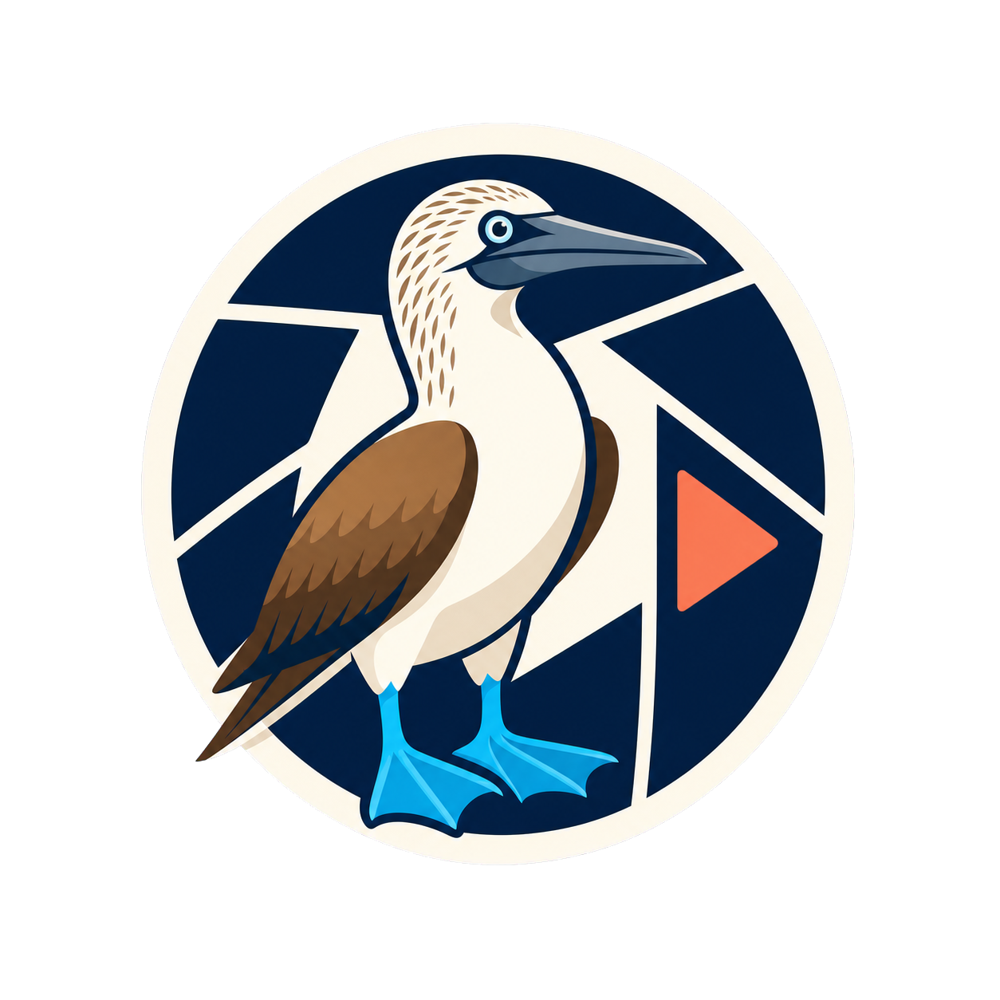

<p align="center">
  
</p>

# boobies-media

A private media library for a small group. It supports resumable uploads,
remote URL ingestion, folders, tags, share pages, user administration, and
nightly SQLite backups.

The server is a Go application with an embedded TypeScript interface. All
persistent state lives in one data directory.

## Features

- Chunked and resumable image and video uploads
- Remote ingestion from direct links, Discord CDN, Twitter/X, YouTube,
  TikTok, and Medal
- SSRF protection on remote HTTP downloads
- `yt-dlp` downloads with a `gallery-dl` fallback for Twitter/X galleries
- Content-addressed media storage and deduplication
- Automatic metadata probes and thumbnails
- Optional lossless WebP conversion
- Folders, tags, search, bulk actions, and random-item API
- Private accounts with session and bearer-token authentication
- Anonymous share pages designed for Discord embeds
- Admin controls for users, jobs, settings, dependencies, and trash
- Nightly SQLite backups with seven-copy retention

## Requirements

For local development:

- Go 1.25 or newer
- Bun
- `ffmpeg` and `ffprobe`
- `cwebp`
- `yt-dlp`
- `gallery-dl`

The included Docker image installs the runtime media tools automatically.

## Local installation

Build the browser assets and server:

```bash
bun install
make build
```

Create the first administrator. The command prompts for a password and prints
an API key once:

```bash
./bin/server user add admin --display-name "Administrator" --admin
```

Start the local server:

```bash
./bin/server \
  -addr 127.0.0.1:8080 \
  -data ./data \
  -base-url http://localhost:8080 \
  -insecure-cookies
```

Open <http://localhost:8080> and sign in with the account you created.

Do not use `-insecure-cookies` in production.

## Configuration

Configuration can be supplied through environment variables or command-line
flags.

| Environment variable | Flag | Default | Purpose |
| --- | --- | --- | --- |
| `BM_ADDR` | `-addr` | `127.0.0.1:8080` | HTTP listen address |
| `BM_DATA_DIR` | `-data` | `data` | Persistent data directory |
| `BM_BASE_URL` | `-base-url` | `http://localhost:8080` | Public origin used in links and embeds |
| `BM_WORKERS` | `-workers` | `2` | Background job worker count |
| `BM_INSECURE_COOKIES` | `-insecure-cookies` | unset | Disables secure cookies when set |

Production must use an HTTPS `BM_BASE_URL` and must leave
`BM_INSECURE_COOKIES` unset.

The data directory contains:

```text
data/
  media.db
  files/
  thumbs/
  avatars/
  backups/
  cookies/
  tmp/
```

Treat the entire directory as sensitive. The database contains password and
session hashes, while the cookie files may grant access to external accounts.

## Deploying to a VPS with Dokploy

This repository includes a production `Dockerfile`. The recommended topology
is:

```text
Browser -> Cloudflare -> Cloudflare Tunnel -> Dokploy Traefik -> boobies-media
```

The tunnel uses outbound connections, so the VPS does not need public
application ports. Dokploy recommends routing a tunnel to Traefik when one
tunnel serves multiple applications.

### 1. Prepare the VPS

Install Dokploy using its current installation instructions:

<https://docs.dokploy.com/docs/core/installation>

Add your domain to Cloudflare and change its nameservers if necessary.

Do not expose the application container directly through a host port. Dokploy
and Traefik should reach it on the internal container network.

### 2. Create the Dokploy application

In Dokploy:

1. Create a project and environment.
2. Create an Application.
3. Select GitHub as the source and choose this repository.
4. Select `Dockerfile` as the build type.
5. Set the Dockerfile path to `Dockerfile`.
6. Set the Docker context path to `.`.
7. Set the container port to `8080`.
8. Do not publish a host port.

The image listens on `0.0.0.0:8080` inside the container.

### 3. Add persistent storage

In the application's Advanced settings, add a Docker volume:

| Setting | Value |
| --- | --- |
| Volume name | `boobies-media-data` |
| Mount path | `/data` |

This volume is mandatory. Deploying without it loses the database and media
when the container is replaced.

Use one application replica. SQLite and local media storage are designed for
one writer using one persistent volume.

### 4. Set environment variables

Add these in the Dokploy Environment tab:

```env
BM_ADDR=0.0.0.0:8080
BM_DATA_DIR=/data
BM_BASE_URL=https://media.example.com
BM_WORKERS=2
```

Replace `media.example.com` with your real hostname.

Do not set `BM_INSECURE_COOKIES`.

### 5. Configure the Dokploy domain

In the application Domains tab:

1. Add `media.example.com`.
2. Select container port `8080`.
3. Use `/` as the path.
4. Leave the internal connection as HTTP.
5. When using Cloudflare Tunnel, do not enable a Dokploy certificate for this
   application. Cloudflare terminates public TLS.

Dokploy applies application domain changes without requiring a full Compose
redeployment.

### 6. Deploy the application

Click Deploy and watch the build logs. The container health check requests
`/robots.txt` on its loopback interface.

If the deployment is unhealthy, check:

- The `/data` volume is writable.
- Port `8080` is configured in the Dokploy domain.
- The image completed its dependency installation.
- The application logs do not report an invalid `BM_BASE_URL`.

### 7. Create the first administrator

After the first deployment, open the Dokploy application terminal and run:

```bash
/app/server user add admin --display-name "Administrator" --admin
```

The command uses `BM_DATA_DIR=/data`, so it modifies the live persistent
database. Save the API key printed by the command. Only its hash is stored and
the original key cannot be recovered later.

### 8. Create the Cloudflare Tunnel

Follow Dokploy's current Cloudflare Tunnel guide:

<https://docs.dokploy.com/docs/core/guides/cloudflare-tunnels>

The recommended Dokploy setup is:

1. In Cloudflare Zero Trust, open Networks, then Connectors.
2. Create a Cloudflared tunnel.
3. Copy its tunnel token.
4. In Dokploy, create a second Application using the Docker provider.
5. Use image `cloudflare/cloudflared`.
6. Add `TUNNEL_TOKEN` with the copied token.
7. Add the arguments `tunnel` and `run`.
8. Deploy the connector.

In the Cloudflare tunnel, add a published application route:

| Setting | Value |
| --- | --- |
| Hostname | `media.example.com` |
| Service type | `HTTP` |
| Service URL | `dokploy-traefik:80` |

Using Traefik preserves the hostname routing configured in Dokploy. The
Cloudflare route hostname and the Dokploy domain must match exactly.

Set the Cloudflare zone SSL/TLS encryption mode to Full or Full (Strict).
Do not use Flexible mode.

### 9. Restrict VPS network exposure

Cloudflare Tunnel does not require inbound application ports. Keep port 8080
closed in the VPS firewall and do not publish it from Docker.

Keep only the ports required for SSH and your chosen Dokploy administration
setup. Protect the Dokploy dashboard separately, preferably with Cloudflare
Access and strong authentication.

## Required Cloudflare rules

### Upload limits

Cloudflare limits proxied request bodies. This application avoids the limit by
uploading files in chunks.

The default settings are:

- `upload_chunk_bytes`: 12 MiB per request
- `upload_max_bytes`: 8 GiB per file
- `download_max_bytes`: 2 GiB for server-side URL ingestion

Keep `upload_chunk_bytes` below the Cloudflare plan's request-body limit.
Large files do not require larger requests because each file is split into
many chunks.

### Cache rules

Create a Cloudflare Cache Rule that bypasses cache when the URI path starts
with either:

- `/m/`
- `/t/`

This prevents private media and thumbnails from being retained in
Cloudflare's CDN and prevents stale bytes after deletion.

Static assets under `/static/` may use normal Cloudflare caching.

### Bot and WAF rules

Discord and other preview crawlers must be able to reach:

- `/s/`
- `/m/`
- `/t/`

Configure WAF, Bot Fight Mode, and challenge rules so legitimate preview
crawlers are not challenged on these paths. A challenged Discord crawler can
cache a failed embed.

Do not make the entire site public. Browse, admin, upload, and API routes
remain protected by application authentication.

### Client IP handling

The application uses `CF-Connecting-IP` for login and public-route rate
limits. This is safe only when traffic reaches the application through the
trusted Cloudflare Tunnel and the origin cannot be reached directly.

Do not add a public port that bypasses Cloudflare.

## External-source cookies

Twitter/X and some YouTube or TikTok media require authenticated browser
cookies.

Export cookies in Netscape format and place them in the persistent volume:

```text
/data/cookies/twitter.txt
/data/cookies/youtube.txt
/data/cookies/tiktok.txt
/data/cookies/medal.txt
```

The conventional filenames are detected automatically. You can instead set
explicit paths from the admin Settings page.

Cookie files are credentials:

- Keep them out of Git.
- Restrict access to the application container.
- Re-export them when a source begins returning authentication errors.
- Use a dedicated external account when practical.

The admin page includes one self-test per supported source.

## Backups

The server creates a nightly SQLite snapshot in:

```text
/data/backups/media-YYYY-MM-DD.db
```

It retains the newest seven snapshots. These snapshots remain on the same
Docker volume and do not protect against VPS or volume loss.

Configure a Dokploy volume backup or another encrypted offsite copy for the
entire `/data` volume. At minimum, copy:

- `/data/media.db`
- `/data/files`
- `/data/thumbs`
- `/data/avatars`
- `/data/backups`
- `/data/cookies`

Test restoration before relying on the backup.

## Updating

Before a major update:

1. Confirm a recent offsite backup exists.
2. Pull or deploy the new `main` revision in Dokploy.
3. Watch the deployment and application logs.
4. Sign in and test an upload, a share page, and one URL ingest.

Database migrations run automatically at startup.

## Administration

The `/admin` page provides:

- User creation and API-key rotation
- Password resets and administrator toggles
- Upload, download, cookie, and format settings
- Dependency status and versions
- URL-ingestion self-tests
- Job retry controls
- Trash restoration and permanent purge

There is no public registration. Add users from the admin page or the server
CLI.

## API authentication

Browser sessions use secure HTTP-only cookies. API clients may send:

```http
Authorization: Bearer YOUR_API_KEY
```

API keys are displayed once when created or rotated.

## Troubleshooting

### Cloudflare returns 502 or 404

- Confirm the tunnel connector is healthy.
- Confirm the tunnel service URL is `http://dokploy-traefik:80`.
- Confirm the hostname matches the Dokploy application domain.
- Confirm the Dokploy domain targets container port `8080`.
- Confirm HTTPS and certificate generation are disabled for the internal
  Dokploy domain when Cloudflare handles TLS.

### Login loops or cookies do not persist

- Confirm `BM_BASE_URL` begins with `https://`.
- Confirm `BM_INSECURE_COOKIES` is unset.
- Confirm Cloudflare SSL/TLS mode is Full or Full (Strict).
- Confirm the browser is using the same hostname configured in
  `BM_BASE_URL`.

### Uploads fail with HTTP 413

Lower `upload_chunk_bytes` in the admin Settings page. Do not lower the total
file limit unless that is your intended policy.

### URL ingestion fails

Open the admin dependency panel and confirm `yt-dlp`, `gallery-dl`, `ffmpeg`,
`ffprobe`, and `cwebp` are available. Then run the source self-test and check
whether the source needs a refreshed cookie file.

### The application restarts with an empty library

The `/data` volume is missing or mounted at the wrong path. Stop deployments
until the original volume is found. Creating new data can make recovery more
confusing.

### Disk usage keeps growing

- Review `/data/files` and the Trash view.
- Permanently purge unwanted items from Trash.
- Check unfinished files under `/data/tmp`.
- Confirm nightly backup retention is working.
- Review Dokploy volume snapshots and offsite backup retention separately.

## Development

Run tests:

```bash
make test
make race
bunx tsc --noEmit
bun test web/src/request.test.ts
```

Build production assets:

```bash
bun run build
```

The JavaScript bundle has a 50 KB budget.

## Security notes

- Remote downloads reject loopback, private, link-local, multicast, CGNAT,
  NAT64, and reserved destinations.
- Redirects are limited and validated at every hop.
- Upload and destructive routes require same-origin requests.
- Public media routes are rate limited.
- The server stores password, session, and API-key hashes rather than raw
  credentials.
- External tools are executed as argument arrays without a shell.
- Missing media tools degrade their related features without stopping the
  server.

Additional operational detail is available in
[`docs/deploy.md`](docs/deploy.md).

## License

No license has been selected yet.
